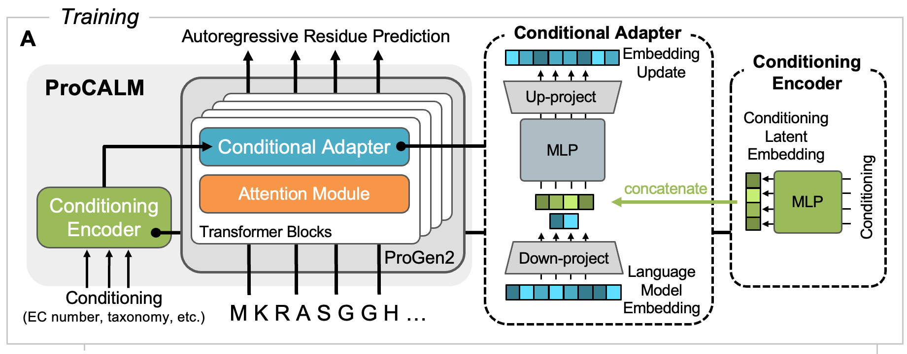

# ProCALM

ProCALM (**Pro**tein **C**onditionally **A**dapted **L**anguage **M**odel) is a method where ProGen2-base is finetuned with conditional adapters for conditional generation of functional enzymes, based on EC number, taxonomy, or both. Model here is refered to as progen-conditional. 

## Setup and Installation
 We have provided `docker/Dockerfile` to build this image. Alternatively, model will run in a conda environment created using `docker/environment.yml`. All results can be downloaded from [here]() and unzipped to replace the `results/checkpoints` folder.

## Dataset Processing
For convenience, processed datasets used for model training and evaluation (excluding the Uniref dataset) are preloaded in this repo.

Alternatively, you can follow these steps to reproduce our dataset processing. The raw data used for training ProCALM is obtained from [Uniprot](https://www.uniprot.org) and other useful files are from the [CARE benchmarks](https://github.com/jsunn-y/CARE/). You will need all enzymes with EC numbers and taxonomy lineages from uniprot for Uniref (>20M) and Swissprot (~200k). Use the versions from June 17, 2024 and export EC number, sequence, entry ID, taxonomy, taxonomy ID, lineage, lineage ID as a tsv. Raw data is alternatively uploaded [here]() and can fill in the `data/raw_data` folder. The `database_setup.py` script will run sequence clustering on Swissprot (requires MMseqs2) and will build Diamond reference databases along with MMseqs2 databases including taxonomy (requires Diamon BLAST). For building the Diamond reference database, you will also need swissprot.fasta file (~550k sequences from June 17, 2024 download). The latter two reference databases are only needed for analysis of generated sequences.

The final splits used in our study are built and saved to sharded datasets using `build_splits.ipynb` under `scripts`. `save_sharded.ipynb` is a shortcut to save sharded datasets from presaved csv files of each split (in particular the sharded version of uniref). You can also use `select_ECs.ipynb` to reproduce how we generated the EC numbers that are used for generation and analysis. 

## Training
Example command for running on 4 40GB A100s:
```
composer main.py --config config/long-final/ec-onehot-swissprot.yml --debug
```
Results will be saved under `results/`. Training should take on the order of 6 hours for every 1 billion tokens. Other configs to reproduce the results from our study are given under `config/long-final/`

## Generation
Example commands to generate sequences with different conditioning using the pretrained models (loaded to [Huggingface Hub](https://huggingface.co/jsunn-y/ProCALM)):

```
#generate for a single EC conditioning
python runner.py --model ec-onehot-swissprot_20240819-231400 --checkpoint ba21000 --ec 4.2.1.20

#generate for EC and taxonomy conditioning
python runner.py --model ec+tax-swissprot_20240819-231401 --checkpoint ba21000 --ec 4.2.1.20 --tax bacteria --num_seqs 225

#ZymCTRL baseline for EC 4.2.1.20
python scripts/ZymCTRL_runner.py
```
Generated sequences will be saved under `results/{model_name}/generated/` as fastas. Generation on a single GPU should take on the order of 1 minute per batch, so 990 sequences will take around 20 minutes on a single 40GB A100.

## Analysis
Example command to get statistics on the generation quality and diversity of generated sequences:
```
python scripts/run_generation_processing.py --model ec+tax-swissprot_20240819-231401 --checkpoint ba21000 --ec 4.2.1.20 --tax bacteria
```
Results will be saved under `results/{model_name}/all_summary_{checkpoint}.csv`. Analysis will fun faster on more CPUs but should take on the order of seconds to one minute per combination of unique conditioning (EC/tax).

Perplexities for different splits can be calculated with `perplexity_calculation.py` under `scripts` and outputs will be saved under `results/{model_name}/perplexity_{checkpoint}.csv`. Perplexity calculation requires a single A100 and should take on the order of minutes to one hour for all datasets on a single checkpoint.

The output csvs can be visualized using `analysis/visualization.ipynb`.

## Limitations
Better logging for losses as training progresses could be implemented, potentially through MLflow.

